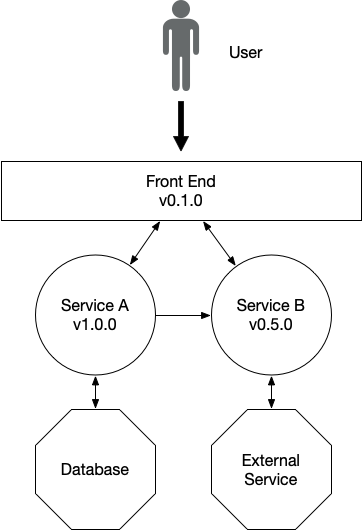

# Scenarios

This short document list a set of scenarios that we are interested in using as references for finding best practices, missing gaps and tools that can help you to accelerate.

## Cloud-Native Scenarios
This scenarios are assuming that you have a Cloud-Native architecture, where several services will be deployed at the same time by different teams. 
Assuming that a continuous delivery approach is implemented, these scenarios list the expectations and actions performed from an organization point of view:

- Dealing with changes in distributed applications
- Adding new services to a distributed application
- Dealing with a platform change (cross-functional change) 
- A/B testing for a single service
- Coordinating A/B testing for a set of services

In the following scenarios you have 3 services: 
- Front End: Serves as the main entry point for your end users. Routes requests to the backend Services A and B
- Service A: Backend REST APIs, Service A call Service B for serving some content. Service A uses a database
- Service B: Backend REST APIs, Service B connects to a third-party service

In the following scenarios, each service/component has its own version and their source code is stored in separate github repositories. 
Each of these components have an automated pipeline that release the changes using a trunk-based development approach. 
These services are using Semantic Versioning.

The following services are running in a Production Environment:

- Front End v0.1.0
- Service A v1.0.0
- Service B v0.5.0

# Scenario 1

Service B has a new release v0.5.1. 
What stepts are needed to get this new version out in front of our users? 

## Questions
- What tools, practices and automation needs to be in place to be able to upgrade Service B from v0.5.0 to v0.5.1 in that Production Environment? 
- What are the important milestones that needs to happen for version v0.5.1 to be accessible by end users?
- What tests needs to be run and need to exist in order to reduce the failure rate and downtime of the application for our users? 
- What deployment strategy (rolling updates, canary deployment, blue-green deployments, etc) should we choose for this scenario and what are the advantages?
- What are the contracts defined by Service B that cannot be broken for patch versions? 

## Approaches

